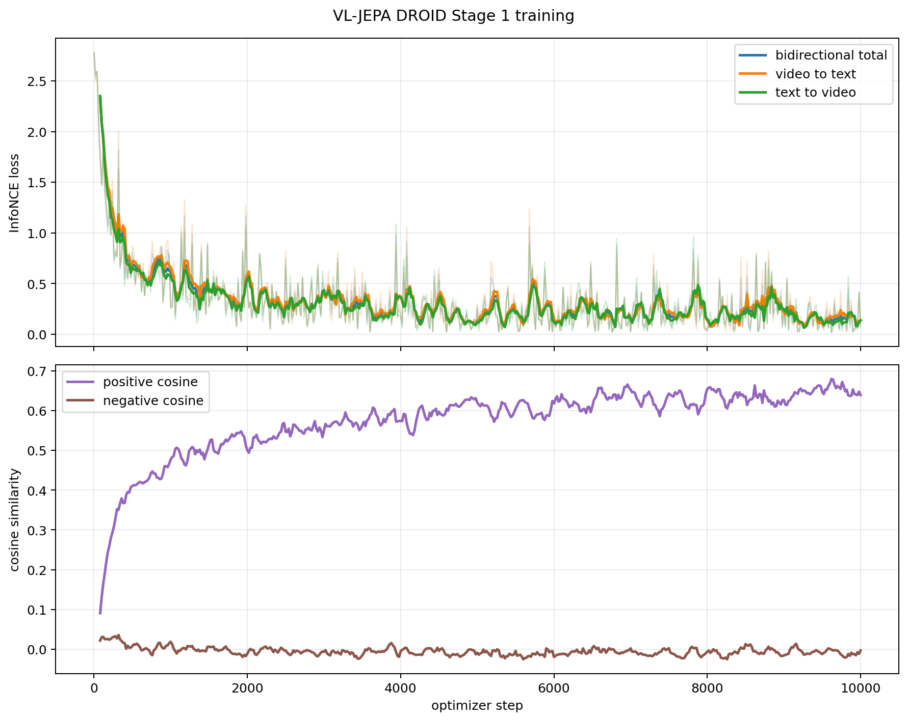

# TaskWatch full-DROID Stage 1 results

The table below records the audited checkpoints from the ongoing 40,000-step
reference run. Step 10,000 is a stage boundary where the checkpoint is audited
and then resumed with optimizer state intact. Metrics use the fixed
1,000-episode validation set. Since 4% of the validation captions are
duplicated, the primary Video-to-Text numbers count any identical target
caption as correct.

| Step | V2T R@1 | V2T R@5 | V2T R@10 | Median rank | Positive cosine |
| ---: | ---: | ---: | ---: | ---: | ---: |
| 500 | 10.5% | 35.1% | 50.5% | 10 | 0.3956 |
| 1,000 | 16.0% | 48.7% | 63.7% | 6 | 0.4802 |
| 1,500 | 20.4% | 53.6% | 68.8% | 5 | 0.5099 |
| 2,000 | 21.6% | 56.2% | 72.7% | 4 | 0.5218 |
| 2,500 | 25.9% | 61.0% | 76.3% | 4 | 0.5421 |
| 3,000 | 29.3% | 63.8% | 77.3% | **3** | 0.5462 |
| 3,500 | 26.9% | 63.6% | 77.8% | **3** | 0.5652 |
| 4,000 | 29.7% | 65.3% | 80.0% | **3** | 0.5673 |
| 4,500 | 30.5% | 67.2% | 80.3% | **3** | 0.5895 |
| 5,000 | 32.8% | 70.0% | 82.8% | **3** | 0.5944 |
| 5,500 | **34.4%** | **71.0%** | **83.4%** | **3** | 0.6042 |
| 6,000 | **35.7%** | **72.1%** | **84.3%** | **2** | 0.6213 |
| 6,500 | 33.9% | **72.9%** | **84.6%** | **2** | 0.6214 |
| 7,000 | 34.7% | **73.0%** | 84.5% | **2** | 0.6096 |
| 7,500 | **38.0%** | **73.8%** | **86.2%** | **2** | 0.6275 |
| 8,000 | 36.4% | 72.2% | 84.2% | **2** | 0.6331 |
| 8,500 | 37.5% | **75.1%** | **87.5%** | **2** | 0.6286 |
| 9,000 | 35.9% | 72.9% | 86.8% | **2** | 0.6319 |
| 9,500 | 37.3% | 74.4% | **87.6%** | **2** | 0.6284 |
| 10,000 | **38.2%** | 74.5% | 87.3% | **2** | **0.6469** |
| 10,500 | 36.8% | 73.4% | 86.7% | **2** | 0.6261 |
| 11,000 | **40.2%** | **76.7%** | **87.6%** | **2** | 0.6466 |
| 11,500 | 39.5% | **76.8%** | **88.7%** | **2** | **0.6567** |
| 12,000 | 36.4% | 75.9% | 88.1% | **2** | 0.6517 |
| 12,500 | 38.0% | 76.5% | 88.4% | **2** | 0.6469 |
| 13,000 | 40.0% | **77.4%** | **89.8%** | **2** | 0.6552 |

At step 3,500, R@1 fluctuated down while R@10 and positive cosine continued to
improve. Step 4,000 recovered that dip, and subsequent milestones through step
6,000 improved all three primary recall metrics again. At step 6,500, R@1
fluctuated down by 1.8 percentage points while R@5 and R@10 improved by 0.8 and
0.3 points, respectively; median rank stayed at 2. Step 7,000 recovered 0.8
R@1 points and set a new R@5 high of 73.0%, while R@10 edged down by 0.1 point.
Step 7,500 then broke through the plateau and set new highs for R@1, R@5, and
R@10. Step 8,000 pulled back by 1.6, 1.6, and 2.0 percentage points,
respectively, despite a higher positive cosine. Step 7,500 remained the best
R@1 milestone at that point. Step 8,500 recovered most of the R@1 pullback and set new
R@5 and R@10 highs. Because the initial stage saves every 1,000 steps, neither
half-step evaluation has a checkpoint. Step 9,000 then pulled back across all
three recall cutoffs. Step 9,500 recovered most of that dip and set a narrowly
higher R@10 of 87.6%, but has no checkpoint because the initial stage does not
save half-step evaluations. Step 10,000 then set a new R@1 high of 38.2% and a
new positive-cosine high of 0.6469, while R@5 and R@10 remained below their
split bests. Step 11,000 subsequently set new R@1 and R@5 highs of 40.2% and
76.7%, while tying the 87.6% R@10 high from step 9,500. The
10,000-to-40,000 continuation saves every 500 steps to align checkpointing with
evaluation. The audited step-10,000 checkpoint contains
the Predictor, Y-Encoder, three optimizer parameter groups with 409 states, and
the constant scheduler at global step 10,000; it excludes the frozen V-JEPA
encoder and Qwen token embedding. The 6.4 GiB checkpoint SHA-256 is
`81d1b7b36a4b18030d6bb146f10aab378c2ddc88b64921c5550ad5d0cd54f864`.
The run is still not treated as monotonically improving.

The first 500-step continuation milestone pulled back from step 10,000 by 1.4,
1.1, and 0.6 percentage points at R@1, R@5, and R@10, respectively. Its median
rank remained 2. This single point is treated as evaluation noise or a possible
early plateau, not yet as evidence of persistent degradation. The audited
step-10,500 checkpoint retains the same model and optimizer structure; its
SHA-256 is
`19bb5678dd405cbce0b0a8229f7de298a3f33334c0b89e58d4111c01ebf16b8d`.
Step 11,000 then rebounded by 3.4, 3.3, and 0.9 points at the three recall
cutoffs, indicating that the step-10,500 pullback was not persistent. Its
audited checkpoint SHA-256 is
`f2dcd7e3d9583e4051e7a6105f0c1d530e93dc2c4388792197c65befb576a41b`.
Step 11,500 raised R@5 and R@10 again before a step-12,000 pullback. Step 12,500
partially recovered, and step 13,000 established new R@5 and R@10 highs of
77.4% and 89.8%, while its 40.0% R@1 remained within 0.2 points of the step-11,000
high. This confirms a noisy upward trend rather than monotonic improvement.
The audited checkpoint SHA-256 values are:

- step 11,500: `73392ebf7a7d4eecfc0697f77bbe580d198f562251c3a136a636a14db83a5cde`
- step 12,000: `0814ff7ec1fb5e644fea38352bfec31a2e44d94751febb8bf3ecb078f0d00a12`
- step 12,500: `bb5c5b9286db022cf6bcbc5d36f61dcdd2abc6167425943ba5a96c65af3156e9`
- step 13,000: `99b7c00431035b80922918d42ca253b3edcb3f5a6e09f396ec1b5ffd924ec6e1`

The first-stage log contains 501 unique records from steps 1 through 10,000,
with no duplicate steps or non-finite losses. Mean total loss fell from 0.9640
over the first 50 records to 0.1564 over the last 50 records.

The random duplicate-aware V2T R@1 baseline is 0.1124%. Machine-readable metric
files live in [`artifacts/full_stage1`](../artifacts/full_stage1/). Full
checkpoints, DROID video tensors, and model weights are intentionally excluded
from Git.

This document is an interim record. It must not be interpreted as the final
40,000-step result until the final checkpoint, retrieval JSON, and loss plots
have been generated and audited.
